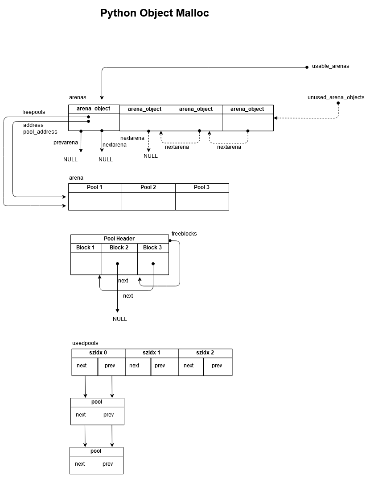

# Python 的内存管理机制

Python 内存管理架构

```
        Object-specific allocators
    _____   ______   ______       ________
   [int] [ dict ] [ list ] ... [ string ]       Python core         |
+3 | <----- Object-specific memory -----> | <-- Non-object memory --> |
    _______________________________       |                           |
   [Python's object allocator]      |                           |
+2 | ####### Object memory ####### | <------ Internal buffers ------> |
    ______________________________________________________________    |
   [Python's raw memory allocator (PyMem_ API)          ]   |
+1 | <----- Python memory (under PyMem manager's control) ------> |   |
    __________________________________________________________________
   [Underlying general-purpose allocator (ex: C library malloc)   ]
 0 | <------ Virtual memory allocated for the python process -------> |

   =========================================================================
    _______________________________________________________________________
   [OS-specific Virtual Memory Manager (VMM)               ]
-1 | <--- Kernel dynamic storage allocation & management (page-based) ---> |
    __________________________________   __________________________________
   [] []
-2 | <-- Physical memory: ROM/RAM --> | | <-- Secondary storage (swap) --> |

```

Python 层面的内存管理重点在 +2 层，其代码在 `obmalloc.c`，主要的 API 是 `PyObject_Malloc` 和 `PyObject_Free`。

## +1 层的内存管理

这一层的内存管理主要是对 C 语言提供的内存管理函数进行封装，以兼容不同平台的行为。

不同平台对 `malloc(0)` 的处理表现不一致，有的平台返回 NULL 以表示错误，有的平台返回一个特殊的指针指向不存在的内存区域。Python 的解决方法是最少分配 1 字节的内存。

## +2 层的内存管理

这一层的内存管理专门针对 Python 中的对象。

Python 中频繁使用对象，因此必然产生大量的内存分配和释放。为了提高内存分配的效率，Python 采取了内存池的方案，如果要分配对象的内存小于一个预设阈值，那么就从内存池中找出一个合适的 block。
通过使用内存池避免了频繁调用 `malloc`。

默认的内存阈值是 `SMALL_REQUEST_THRESHOLD = 256`。

内存池使用的内存管理技术叫做「简单分离存储」，将内存池中的内存按照大小分成不同的块（block），这个大小叫做 size class，相同 size class 的块组织到一个 pool 中。当想要申请内存时，就从 pool 中找出最合适的一个空闲块。

size class 是 8 的倍数，最小的 size class 是 8 字节，接下来依次是 16、24、32、40、...、256。

```
* For small requests we have the following table:
 *
 * Request in bytes     Size of allocated block      Size class idx
 * ----------------------------------------------------------------
 *        1-8                     8                       0
 *        9-16                   16                       1
 *       17-24                   24                       2
 *       25-32                   32                       3
 *       33-40                   40                       4
 *       41-48                   48                       5
 *       49-56                   56                       6
 *       57-64                   64                       7
 *       65-72                   72                       8
 *        ...                   ...                     ...
 *      497-504                 504                      62
 *      505-512                 512                      63
 *
 *      0, SMALL_REQUEST_THRESHOLD + 1 and up: routed to the underlying
 *      allocator.
 */

/*==========================================================================*/
```


### pool 和 block

一个 pool 的大小一般等于虚拟内存页的大小，即 4KB。pool 包含一个 pool 头部和许多的 block，pool 中所有的 block 都是相同大小的。

pool 头部的定义：

```C
// Objects/obmalloc.c

/* Pool for small blocks. */
struct pool_header {
    union { block *_padding;
            uint count; } ref;          /* number of allocated blocks    */
    block *freeblock;                   /* pool's free list head         */
    struct pool_header *nextpool;       /* next pool of this size class  */
    struct pool_header *prevpool;       /* previous pool       ""        */
    uint arenaindex;                    /* index into arenas of base adr */
    uint szidx;                         /* block size class index        */
    uint nextoffset;                    /* bytes to virgin block         */
    uint maxnextoffset;                 /* largest valid nextoffset      */
};
```

pool_header 的大小可能不是 8 字节的整数倍，为了对齐 pool_header 后面会填充一些字节。计算方式如下：

```C
#define POOL_OVERHEAD   _Py_SIZE_ROUND_UP(sizeof(struct pool_header), ALIGNMENT)
```

pool 的状态：

- used

  pool 中至少有一个空闲 block，至少有一个已分配的 block。也就是说 pool 中一部分 block 被分配了，还剩下一部分 block 是空闲的。

  used 状态的 pool 通过 usedpools 的循环双向链表连接在一起。

- full

  pool 中所有 block 都被分配了。full 状态的 pool 不被任何链表连接，是游离的。

- empty

  pool 中所有 block 都是空闲的。empty 状态的 pool 通过 arena_object 的 freepools 链表连接在一起。


当一个 pool 被初始化时，第一个 block 用于分配，freeblock 指向第二个 block，nextoffset 指向第三个 block，maxnextoffset 指向最后一个 block。当从 pool 中申请新的 block 时，返回 freeblock 指向的 block，然后 freeblock 指向 nextoffset。

如果 pool 中的 block 在将来被释放，那么使 freeblock 指向该 block，并在该 block 中设置一个指针，指向原来的 freeblock。从而 freeblock  指向一个空闲 block 的链表。


#### 解释 usedpools

```C
#define PTA(x)  ((poolp )((uchar *)&(usedpools[2*(x)]) - 2*sizeof(block *)))
#define PT(x)   PTA(x), PTA(x)

static poolp usedpools[2 * ((NB_SMALL_SIZE_CLASSES + 7) / 8) * 8] = {
    PT(0), PT(1), PT(2), PT(3), PT(4), PT(5), PT(6), PT(7)
#if NB_SMALL_SIZE_CLASSES > 8
    , PT(8), PT(9), PT(10), PT(11), PT(12), PT(13), PT(14), PT(15)
#if NB_SMALL_SIZE_CLASSES > 16
    , PT(16), PT(17), PT(18), PT(19), PT(20), PT(21), PT(22), PT(23)
#if NB_SMALL_SIZE_CLASSES > 24
    , PT(24), PT(25), PT(26), PT(27), PT(28), PT(29), PT(30), PT(31)
#if NB_SMALL_SIZE_CLASSES > 32
    , PT(32), PT(33), PT(34), PT(35), PT(36), PT(37), PT(38), PT(39)
#if NB_SMALL_SIZE_CLASSES > 40
    , PT(40), PT(41), PT(42), PT(43), PT(44), PT(45), PT(46), PT(47)
#if NB_SMALL_SIZE_CLASSES > 48
    , PT(48), PT(49), PT(50), PT(51), PT(52), PT(53), PT(54), PT(55)
#if NB_SMALL_SIZE_CLASSES > 56
    , PT(56), PT(57), PT(58), PT(59), PT(60), PT(61), PT(62), PT(63)
#if NB_SMALL_SIZE_CLASSES > 64
#error "NB_SMALL_SIZE_CLASSES should be less than 64"
#endif /* NB_SMALL_SIZE_CLASSES > 64 */
#endif /* NB_SMALL_SIZE_CLASSES > 56 */
#endif /* NB_SMALL_SIZE_CLASSES > 48 */
#endif /* NB_SMALL_SIZE_CLASSES > 40 */
#endif /* NB_SMALL_SIZE_CLASSES > 32 */
#endif /* NB_SMALL_SIZE_CLASSES > 24 */
#endif /* NB_SMALL_SIZE_CLASSES > 16 */
#endif /* NB_SMALL_SIZE_CLASSES >  8 */
};
```

usedpools 是一个非常古怪的数组，usedpools 将所有 used 状态的 pool 组织成一个循环双向链表。usedpools[i + i] 是 size class index 等于 i 的 pool 的循环双向链表的头。

usedpools[i + i] 是一个 poolp 类型的指针，指向一个 pool_header。在上面的初始化代码中，仔细研究可以发现 usedpools[i + i] 其实等于 `(uchar *)&(usedpools[i + i]) - 2 * sizeof(block *)`，也就是说它指向前面两个元素，考虑到 pool_header 的前面两个字段的长度恰好等于 `2 * sizeof(block *)`，所以相当于将前面两个元素当作是 pool_header 的前两个字段，将 usedpool[i + i] 和 usedpool[i + i + 1] 当作是 pool_header 的 nextpool 和 prevpool。


### arena

一个 arena 包含许多的 pool，arena 的大小等于 256KB。arena 只是一大块内存块，它通过 arena_object 来表示和管理。另外，使用一个数组来保存 arena_object。

arena_object 的定义：

```C
// Objects/obmalloc.c

/* Record keeping for arenas. */
struct arena_object {
    /* The address of the arena, as returned by malloc.  Note that 0
     * will never be returned by a successful malloc, and is used
     * here to mark an arena_object that doesn't correspond to an
     * allocated arena.
     */
    uptr address;

    /* Pool-aligned pointer to the next pool to be carved off. */
    block* pool_address;

    /* The number of available pools in the arena:  free pools + never-
     * allocated pools.
     */
    uint nfreepools;

    /* The total number of pools in the arena, whether or not available. */
    uint ntotalpools;

    /* Singly-linked list of available pools. */
    struct pool_header* freepools;

    /* Whenever this arena_object is not associated with an allocated
     * arena, the nextarena member is used to link all unassociated
     * arena_objects in the singly-linked `unused_arena_objects` list.
     * The prevarena member is unused in this case.
     *
     * When this arena_object is associated with an allocated arena
     * with at least one available pool, both members are used in the
     * doubly-linked `usable_arenas` list, which is maintained in
     * increasing order of `nfreepools` values.
     *
     * Else this arena_object is associated with an allocated arena
     * all of whose pools are in use.  `nextarena` and `prevarena`
     * are both meaningless in this case.
     */
    struct arena_object* nextarena;
    struct arena_object* prevarena;
};
```

arena_object 有两种状态:

- unused

  此时的 arena_object 没有关联 arena。address 字段等于 0。所有 unused 状态的 arena_object 通过 unused_arena_objects 单向链表连接在一起。

- usable

  此时的 arena_object 关联了一个 arena，address 字段不等于 0。所有 usable 状态的 arena_object 通过 usable_arenas 双向链表连接在一起。

- full

  此时 arena_object 关联的 arena 的空间全部被使用完了，arena_object 从 usable_arenas 链表上分离出来。

  usable_arenas 链表是根据 arena_object 的 nfreepools 从小到大排序的，这样排序的目的是为了尽量将快要分配满的 arena_object 耗尽，而将空闲的 arena_object 放到后面。当空闲 arena_object 的 nfreepools 等于 ntotalpools 时，便释放 arena_object 关联的 arena 的内存给操作系统。

当没有可用的 pool 时，new_arena 函数负责分配新的 arena_object，一般是从 unused_arena_objects 链表中取出一个 arena_objecgs。如果 unused_arena_objects 链表用完，那么 new_arena 向操作系统申请新的内存用于新的 arena_object，新的 arena_object 添加到 unused_arena_objects 链表中。

```C
...
    if (unused_arena_objects == NULL) {
        uint i;
        uint numarenas;
        size_t nbytes;

        /* Double the number of arena objects on each allocation.
         * Note that it's possible for `numarenas` to overflow.
         */
        numarenas = maxarenas ? maxarenas << 1 : INITIAL_ARENA_OBJECTS;
        if (numarenas <= maxarenas)
            return NULL;                /* overflow */
#if SIZEOF_SIZE_T <= SIZEOF_INT
        if (numarenas> PY_SIZE_MAX / sizeof(*arenas))
            return NULL;                /* overflow */
#endif
        nbytes = numarenas * sizeof(*arenas);
        arenaobj = (struct arena_object *)PyMem_RawRealloc(arenas, nbytes);
        if (arenaobj == NULL)
            return NULL;
        arenas = arenaobj;

        /* We might need to fix pointers that were copied.  However,
         * new_arena only gets called when all the pages in the
         * previous arenas are full.  Thus, there are *no* pointers
         * into the old array. Thus, we don't have to worry about
         * invalid pointers.  Just to be sure, some asserts:
         */
        assert(usable_arenas == NULL);
        assert(unused_arena_objects == NULL);

        /* Put the new arenas on the unused_arena_objects list. */
        for (i = maxarenas; i < numarenas; ++i) {
            arenas[i].address = 0;              /* mark as unassociated */
            arenas[i].nextarena = i < numarenas - 1 ?
                                   &arenas[i+1] : NULL;
        }

        /* Update globals. */
        unused_arena_objects = &arenas[maxarenas];
        maxarenas = numarenas;
    }
...
```

### 分配内存

`_PyObject_Alloc` 函数负责实际的分配内存的工作。

流程：

1. 如果要申请的内存大于 `SMALL_REQUEST_THRESHOLD`，那么使用 +1 层的 `PyMem_xxx` 函数分配内存。

2. 计算申请的内存对应的 size class index，如果 usedpools[size class index * 2] 没有可用的 pool，那么从 usable_arenas 链表中取出一个可用的 pool。

    1. 如果 usable_arenas 等于 NULL，意味着所有 pool 都使用完了。那么调用 `new_arena` 函数分配新的 arena_object。usable_arena 指向新分配的 arena_object，prevarena 和 nextarena 等于 NULL。

    2. 从 usable_arenas 链表中的第一个 arena_object 中取出一个 pool，如果 pool 等于 NULL，说明这个 arena_object 中的 pool 一直被分配，而还没有被归还过。此时将 pool_address 指向的 poll 分配出去，并设置 pool 的 arenaindex。

    3. 如果 pool 不等于 NULL，就使用这个 pool。

    4. 接着 nfreepools 减 1，如果 nfreepools 等于 0，说明这个 arena_object 的 pool 用完了，那么将这个 arena_object 从 usable_arenas 链表移除。

    5. 需要初始化 pool。例如：

        - 将 pool 加入 usedpools[i + i] 的循环双向链表。

        - 初始化 pool_header 的 szidx、nextoffset、maxnextoffset 和 freeblocks。

    6. 返回对应的 block。

3. 如果 usedpools 有可用的 pool，那么从第一个 pool 中取出一个 block 并返回。如果 pool 所有的 block 都分配完了，那么将 pool 移除 usedpools 。

### 释放内存

`_PyObject_Free` 函数负责实际的释放内存的工作。

流程：

1. 为了安全考虑，首先检查 block 的地址是否属于内存池。如果不属于内存池，那么使用 `PyMem_RawFree` 函数释放该内存。

2. 假设 pool 表示包含该 block 的 pool，将 block 添加到 freeblocks 链表。

3. 如果 pool 处于 full 状态，由于释放了一个 block，pool 从 full 变为 used，因此将 pool 添加到 usedpools 链表中。

4. 如果 pool 由于释放一个 block 变为 empty 状态，那么：

    1. 将 pool 从 usedpools 链表中移除。

    2. 将 pool 添加到 arena_object 的 freepools 链表中。nfreepools 加 1。

    3. 如果 arena_object 的 nfreepools 等于 ntotalpools，说明 arena_object 的所有的 pool 都是空闲的，因此可以将 arena_object 关联的 arena 内存释放掉，然后将 arena_object 从 usable_arenas 链表中移除，然后加入 unused_arena_objects 链表。

    4. 如果 arena_object 的 nfreepools 等于 1，说明 arena_object 从 full 变为 usable 状态。将 arena_object 加入 usable_arenas 链表。

    5. 如果 arena_object 的 nfreepools 属于其它情况，则检查 nfreepools 是否大于下一个 arena_object 的 nfreepools，如果大于则说明 usable_arenas 链表的顺序被破坏了，需要将 arena_object 移到链表后面适当的位置。

    6. 返回。

5. 如果 pool 仍处于 used 状态，那么直接返回。

### 一些细节

- usedpools 的结构。

- freeblock 指针的处理。

- freepools 指针的处理。

- arena 中对 pool 地址的对齐和 pool 中对 block 地址的对齐。

- 计算一个指针所属的 pool。

  `#define POOL_ADDR(P) ((poolp)_Py_ALIGN_DOWN((P), POOL_SIZE))`

- 计算一个指针是否属于内存池（arena）。

  ```
  #define Py_ADDRESS_IN_RANGE(P, POOL)                    \
    ((arenaindex_temp = (POOL)->arenaindex) < maxarenas &&              \
     (uptr)(P) - arenas[arenaindex_temp].address < (uptr)ARENA_SIZE && \
     arenas[arenaindex_temp].address != 0)
  ```

### 其它函数

为了方便，Python 内部对 PyObject_Malloc 函数进行了封装，例如 PyObject_New 等函数。

```C
PyObject *
PyObject_Init(PyObject *op, PyTypeObject *tp)
{
    if (op == NULL)
        return PyErr_NoMemory();
    /* Any changes should be reflected in PyObject_INIT (objimpl.h) */
    Py_TYPE(op) = tp;
    _Py_NewReference(op);
    return op;
}

PyVarObject *
PyObject_InitVar(PyVarObject *op, PyTypeObject *tp, Py_ssize_t size)
{
    if (op == NULL)
        return (PyVarObject *) PyErr_NoMemory();
    /* Any changes should be reflected in PyObject_INIT_VAR */
    op->ob_size = size;
    Py_TYPE(op) = tp;
    _Py_NewReference((PyObject *)op);
    return op;
}

PyObject *
_PyObject_New(PyTypeObject *tp)
{
    PyObject *op;
    op = (PyObject *) PyObject_MALLOC(_PyObject_SIZE(tp));
    if (op == NULL)
        return PyErr_NoMemory();
    return PyObject_INIT(op, tp);
}

PyVarObject *
_PyObject_NewVar(PyTypeObject *tp, Py_ssize_t nitems)
{
    PyVarObject *op;
    const size_t size = _PyObject_VAR_SIZE(tp, nitems);
    op = (PyVarObject *) PyObject_MALLOC(size);
    if (op == NULL)
        return (PyVarObject *)PyErr_NoMemory();
    return PyObject_INIT_VAR(op, tp, nitems);
}
```

指的注意的是 `tp->basicsize` 和 `tp->itemsize`。


### 内存池布局



### 总结

Python 使用了「简单分离存储」的内存管理技术，将内存池中的 block 按照 size class 规划为不同的大小，size class 是 8 的倍数，最小的 block 等于 8 个字节，相同 size class 的 block 放到一个 pool 中。

block 是内存池中的基本单位，也就是说最少分配一个 block。例如想要申请一块 20 字节的内存，那么 Python 会分配一个 24（size class index = 2）字节的 block，意味着有 4 个字节的浪费。

通过 usedpools 数组管理不同 size class 的 pool，usedpools[i * 2] 指向 size class index 等于 i 的 pool 链表。

当申请内存时，计算内存大小对应的 size class index，然后从 usedpools 中的 pool 取出合适的 block。

当释放内存时，将 block 归还给对应的 pool。

为了管理 pool，使用 arena_object 结构，arena_object 负责分配一个比 pool 更大的内存区域，一般等于 256KB，而 pool 等于 4KB，也就是说 arena_object 分配的内存区域可以容纳 64 个 pool。

arena_object 是内存池中最大的单位，当内存池没有可用的 pool 时，就使用 malloc 系统调用向操作系统申请新的 arena_object，将新申请的内存划入内存池。当 arena_object 中的所有 pool 都被释放后，arena_object 的内存会返回给操作系统。

总的来说，这种内存分配策略优点是分配速度快，减少 malloc 系统调用，缺点是容易造成内部碎片和潜在的内存长期占用，内存池的内存只有在 arena_object 的所有 pool 都被释放后才会归还给操作系统，典型的空间换时间。


## +3 层的内存管理

这一层的内存管理主要和具体的对象有关，例如内部的整数、列表、字典和字符串对象。

这些内部对象的使用频率非常高，为了避免频繁的分配对象的内存，Python 的做法是为这些对象分配独立的内存池。当需要分配对象时，就从内存池取出一个对象的内存，当释放一个对象时，其内存归还给内存池。其实内存池就是一个简单的数组，数组元素指向对象的内存。指的注意的是，内存池并不保存对象内部指向的数据结构，而是只保存对象本身的结构体。以列表为例，内存池保存列表对象的结构体 `listobj`，但是不保存列表指向的数组，因为这些数组非常占据内存，而且也不好重复利用。